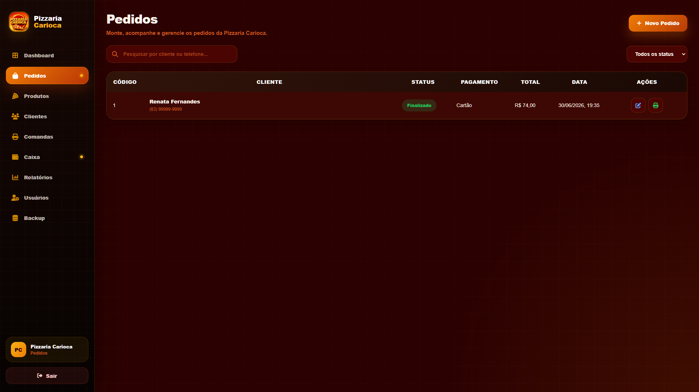
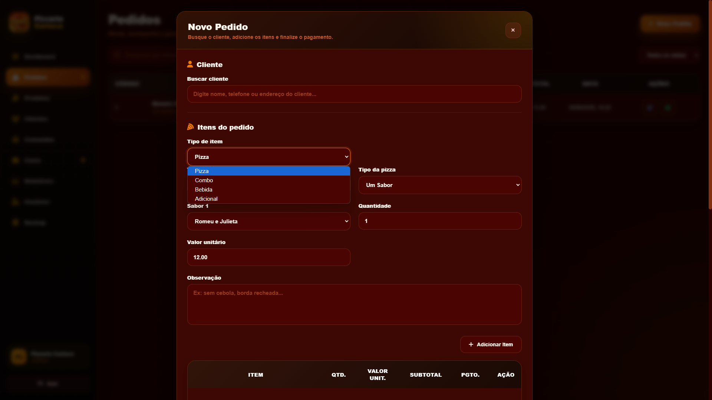
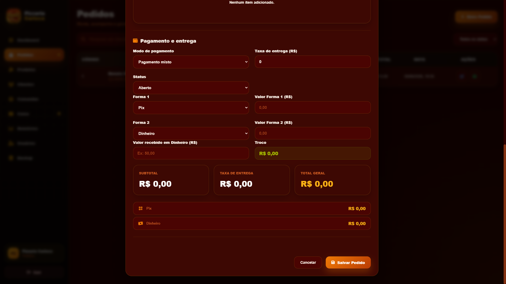
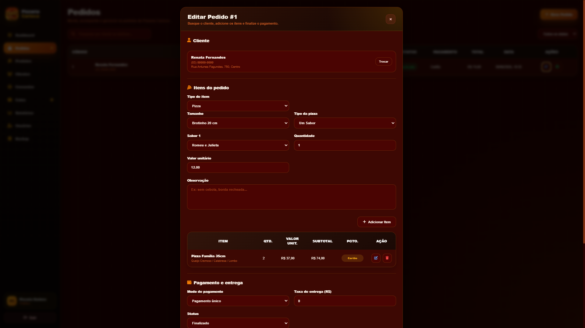
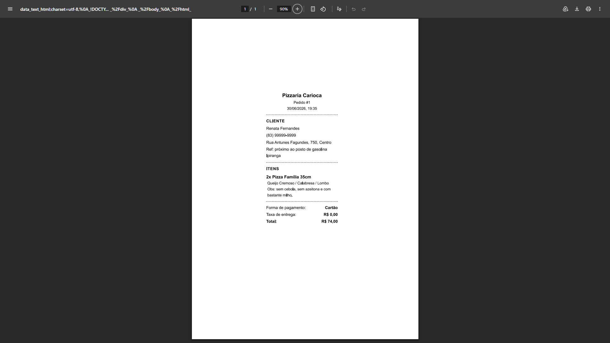
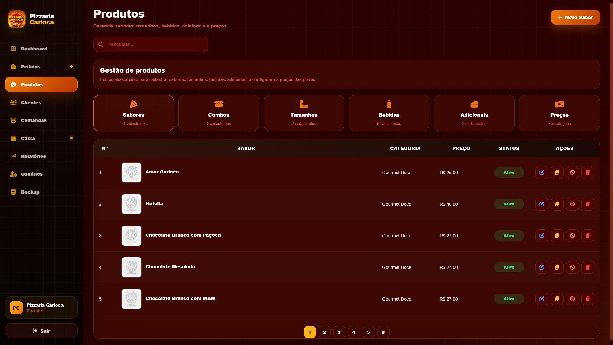
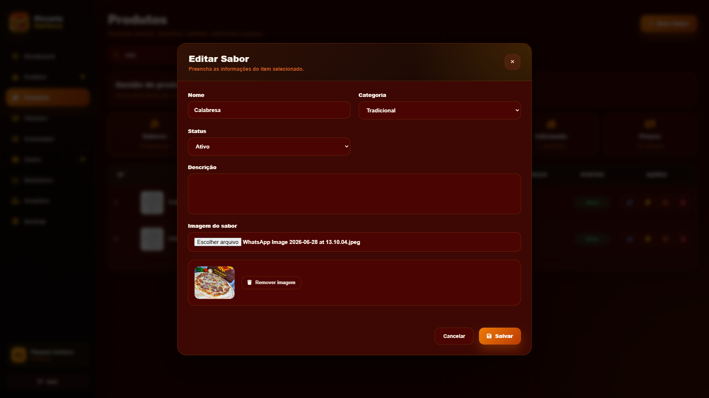

<h1 align="center">🍕 Pizzaria Carioca — Sistema de Gestão</h1>

<p align="center">
  Sistema desktop desenvolvido para gerenciamento completo de uma pizzaria, incluindo pedidos, comandas, caixa, relatórios e muito mais.
  <br><br>
  <em>Desktop management system built for a pizzeria, covering orders, receipts, cash register, reports and more.</em>
</p>

---

## 🇧🇷 Português

### Sobre o projeto

Sistema desenvolvido sob demanda para a **Pizzaria Carioca**, uma pizzaria localizada em João Pessoa - PB. O sistema substitui o controle manual de pedidos e oferece uma solução completa e offline para o dia a dia da operação.

### Funcionalidades

- 🛒 **Pedidos** — criação, edição e acompanhamento de pedidos com carrinho completo
- 🍕 **Cardápio** — gestão de sabores (Tradicional, Gourmet), tamanhos, bebidas, adicionais e combos
- 🖨️ **Comandas** — impressão térmica automática (impressora 80mm) com layout otimizado
- 💰 **Caixa** — abertura, fechamento, movimentações e histórico
- 💳 **Pagamentos** — suporte a Pix, Dinheiro, Cartão e pagamento misto (ex: Pix + Dinheiro)
- 📊 **Relatórios** — diário e mensal com exportação em PDF
- 👥 **Clientes** — cadastro completo com endereço e ponto de referência
- 👤 **Usuários** — controle de acesso com perfis admin e atendente
- 💾 **Backup** — automático diário e manual, com restauração

## 📸 Capturas de tela











### Tecnologias

- **Electron** — aplicação desktop multiplataforma
- **SQLite3** — banco de dados local e portátil
- **JavaScript Vanilla** — sem frameworks frontend
- **bcryptjs** — criptografia de senhas
- **electron-builder** — empacotamento como `.exe` portátil

### Arquitetura

Controller → Service → Repository → SQLite
IPC (Main ↔ Renderer via preload)


### Como rodar localmente

```bash
# Instalar dependências
npm install

# Iniciar em modo desenvolvimento
npm start

# Gerar executável
npm run build
```


---

## 🇺🇸 English

### About

A desktop management system built on demand for **Pizzaria Carioca**, a pizzeria based in João Pessoa, Brazil. It replaces manual order tracking and provides a fully offline solution for daily operations.

### Features

- 🛒 **Orders** — create, edit and track orders with a full cart system
- 🍕 **Menu** — manage flavors (Traditional, Gourmet), sizes, drinks, extras and combos
- 🖨️ **Receipts** — automatic thermal printing (80mm printer) with optimized layout
- 💰 **Cash Register** — open, close, transactions and history
- 💳 **Payments** — Pix, Cash, Card and mixed payments (e.g. Pix + Cash)
- 📊 **Reports** — daily and monthly with PDF export
- 👥 **Customers** — full registration with address and reference point
- 👤 **Users** — access control with admin and attendant roles
- 💾 **Backup** — automatic daily and manual, with restore

## 📸 Screenshots


### Tech Stack

- **Electron** — cross-platform desktop app
- **SQLite3** — local and portable database
- **Vanilla JavaScript** — no frontend frameworks
- **bcryptjs** — password encryption
- **electron-builder** — packaged as portable `.exe`

### Architecture

Controller → Service → Repository → SQLite
IPC (Main ↔ Renderer via preload)


### Running locally

```bash
# Install dependencies
npm install

# Start in development mode
npm start

# Build executable
npm run build
```

---

<p align="center">
  Desenvolvido por <a href="https://github.com/amfpdev-coder">amfpdev</a> • 2026
</p>
